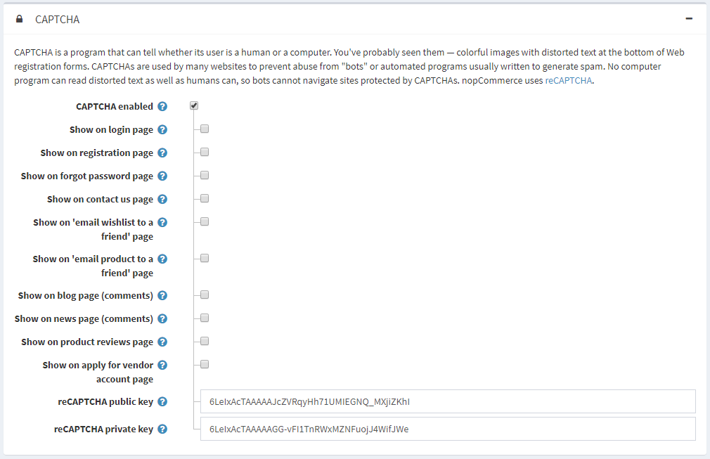

# Security Settings

To manage Security Settings go to **Configuration → Settings → General Settings.** The Security Settings block is displayed on the General Settings page:

Define the **Security Settings,** as follows:

* In the Admin area allowed IP field, enter the **IP addresses** that are allowed to access the backend. Leave this field empty if you do not want to restrict access to the backend. Use commas between the IP addresses (for example, 127.0.0.10, 232.18.204.16).
* Tick the **Force SSL** for all site Pages to enforce SSL for the entire site. This is useful only when you have SSL enabled on your store details pages.
* Tick the **Enable XSRF protection for admin area** to enable XSRF security for all pages in the admin area. Cross-site request forgery, also known as a one-click attack or session riding and abbreviated as CSRF (sometimes pronounced sea-surf) or XSRF, is a type of malicious exploit of a website whereby unauthorized commands are transmitted from a user that the website trusts.
* Tick the **Enable XSRF protection for public store** to enable XSRF security for pages in the public store. Cross-site request forgery, also known as a one-click attack or session riding and abbreviated as CSRF (sometimes pronounced sea-surf) or XSRF, is a type of malicious exploit of a website whereby unauthorized commands are transmitted from a user that the website trusts.
* Tick the **Enable honeypot to enable [honeypot](https://en.wikipedia.org/wiki/Honeypot_(computing)).** In computer terminology, a honeypot is a trap set to detect, deflect, or, in some manner, counteract attempts at unauthorized use of information systems.
* In the **Encryption private key** field, enter the encryption private key used for storing sensitive data. Click Change at any time to change this key. All sensitive data is encrypted using this private key.

> [!NOTE]
>  It is recommended to make a backup of your database before you change the encryption key. Sensitive data includes all credit card information (only when this credit card information is stored in the store database).

The next panel will reveal following settings when **CAPTCHA enabled** is ticked:

* Show CAPTCHA on the **login page.**
* Show CAPTCHA on the **registration page.**
* Show CAPTCHA on the **forgot password page.**
* Show CAPTCHA on the **contact us page.**
* Show CAPTCHA on the **'email wishlist to a friend' page.**
* Show CAPTCHA on the **'email product to a friend' page.**
* Enter the reCAPTCHA **public key** if enabled.
* Enter the reCAPTCHA **private key** if enable.

> [!NOTE] Dropped support for Recaptcha v1.
