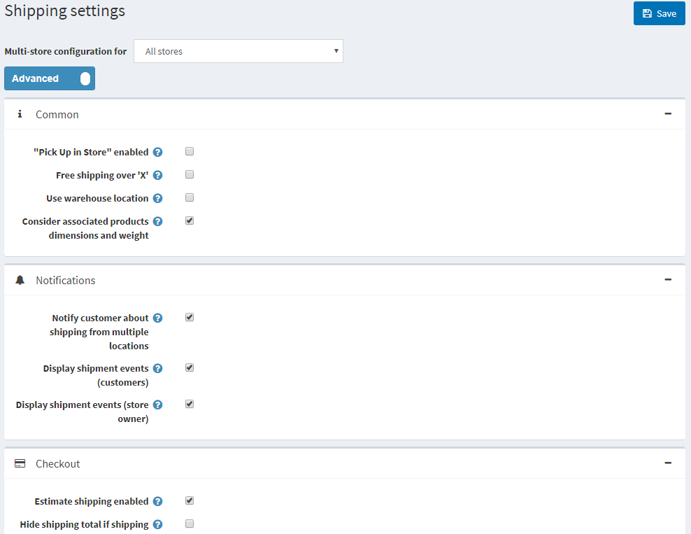

# Shipping Settings

This chapter describes how to **set up the shipping details of a store**. Besides the location and warehouses set, there are other things which comprise good logistics.

To manage shipping settings go to **Configuration → Settings → Shipping Settings**.

Select the **Pick Up in Store enabled** to display the pickup in store option during checkout at the shipping address step. Users will see the following screen:

* Choose to **Display Pickup points on the map** if you want to display them on the Google Maps. Customers should not enter a shipping address and choose a shipping method when this option is selected. Note: You can also specify a fee for the 'Pick Up in Store' option.
* Tick **Free shipping over ‘x’**, to enable free shipping for orders over a certain total amount. The following field is then displayed, enabling you to define the value of X:
* In the **Value of X** field, enter the value over which all orders with a total greater than this will qualify for free shipping.
* Calculate 'X' including tax. If it is not ticked, the value is calculated excluding tax.
* Tick **Estimate shipping enabled** to enable customers to see a shipping estimate on the shopping cart page in the public store, as follows:

* Tick **Use warehouse location** to use it when requesting shipping rates. This is useful when you ship from multiple warehouses.
* Tick **Notify customer about shipping from multiple locations** if required. This is useful when you ship from multiple warehouses.
* Tick **Display shipment events (customers)**, to enable customers to view shipment events on their shipment details page. Note: to be enabled, this feature must be supported by a shipment computation method
* Tick **Display shipment events (store owners)**, to enable store owners to view shipment events on their shipment details page. Note: to be enabled, this feature must be supported by a shipment computation method
* Tick **Bypass shipping method page** if there's only one shipping method available. This page will not be displayed during the checkout process.

Define the **shipping origin details**:

* Select the **Country**
* Select the **State/Province**
* Enter the required **City**
* Enter the required **Address 1**
* Enter the required **Zip / Postal code**

Click **Save**.
