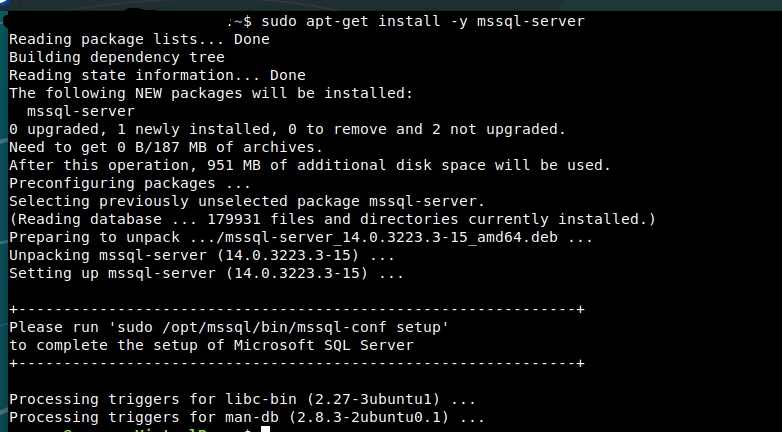
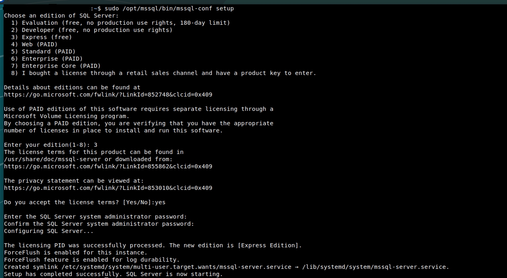

# Installing on Linux

This chapter describes how to install the nopCommerce software on Linux system on the example of XUbuntu 19.04:

1. Install and configure software
1. Get nopCommerce
1. Create and configure the nopCommerce Web service


## 1. Install and configure software

Before installing .NET Core, we'll need to register the Microsoft key and install required dependencies. This needs to be done once per each machine.

### Register Microsoft key and feed

Open a terminal and run the following commands:

`wget -q https://packages.microsoft.com/config/ubuntu/19.04/packages-microsoft-prod.deb -O packages-microsoft-prod.deb`

`sudo dpkg -i packages-microsoft-prod.deb`


### Install the .NET Core Runtime

Update the products available for installation, then install the .NET runtime:

`sudo apt-get update`

`sudo apt-get install apt-transport-https aspnetcore-runtime-2.2`


*if you have any error see detail information on the https://dotnet.microsoft.com/download/linux-package-manager/ubuntu19-04/runtime-current page*

You may see all installed .Net Core runtimes by the following command:

`dotnet --list-runtimes`


### Install SQL Server

Register the Microsoft SQL Server Ubuntu repository (for ubuntu 16.04 but it work on 19.04)

`sudo add-apt-repository "$(wget -qO- https://packages.microsoft.com/config/ubuntu/16.04/mssql-server-2017.list)"`


Then install SQL Server 2017:

`sudo apt-get update`

`sudo apt-get install -y mssql-server`



At last configure SQL Server:

`sudo /opt/mssql/bin/mssql-conf setup`



You may see Microsoft SQL Server status by the following command:

`sudo systemctl status mssql-server`


### Install nginx

Install the nginx package:

`sudo apt-get install nginx`


Run the nginx service:

`sudo systemctl start nginx`

and check it status:

`sudo systemctl status nginx`


To configure nginx as a reverse proxy to forward requests to your ASP.NET Core app, modify /etc/nginx/sites-available/default. Open it in a text editor and replace the contents with the following:

```

          # Default server configuration
          #
          server {
          listen 80 default_server;
          listen [::]:80 default_server;

          server_name   nopCommerce-420.com;

          location / {
          proxy_pass         http://localhost:5000;
          proxy_http_version 1.1;
          proxy_set_header   Upgrade $http_upgrade;
          proxy_set_header   Connection keep-alive;
          proxy_set_header   Host $host;
          proxy_cache_bypass $http_upgrade;
          proxy_set_header   X-Forwarded-For $proxy_add_x_forwarded_for;
          proxy_set_header   X-Forwarded-Proto $scheme;
          }

          # SSL configuration
          #
          # listen 443 ssl default_server;
          # listen [::]:443 ssl default_server;
          #
          # Note: You should disable gzip for SSL traffic.


          # See: https://bugs.debian.org/773332
          #
          # Read up on ssl_ciphers to ensure a secure configuration.


          # See: https://bugs.debian.org/765782
          #
          # Self signed certs generated by the ssl-cert package
          # Don't use them in a production server!


          #
          # include snippets/snakeoil.conf;
          }

```

## 2. Get nopCommerce

Create a directory

`mkdir /var/www/nopCommerce420`

Download and unpack the nopCommerce:

`cd /var/www/nopCommerce420`

`sudo wget https://github.com/nopSolutions/nopCommerce/releases/download/release-4.20/nopCommerce_4.20_NoSource_FrameworkDependent.rar`

`sudo apt-get install unrar`

`sudo unrar x nopCommerce_4.20_NoSource_FrameworkDependent.rar`

Create couple directories to run nopCommerce:

`sudo mkdir bin`

`sudo mkdir logs`

Change the file permissions

cd .. sudo chgrp -R www-data nopCommerce420/ sudo chown -R www-data nopCommerce420/

## 3. Create the nopCommerce service

Create the /etc/systemd/system/nopCommerce420.service file with the following contents:

```

          [Unit]
          Description=Example nopCommerce app running on XUbuntu

          [Service]
          WorkingDirectory=/var/www/nopCommerce420
          ExecStart=/usr/bin/dotnet /var/www/nopCommerce420/Nop.Web.dll
          Restart=always
          # Restart service after 10 seconds if the dotnet service crashes:
          RestartSec=10
          KillSignal=SIGINT
          SyslogIdentifier=nopCommerce420-example
          User=www-data
          Environment=ASPNETCORE_ENVIRONMENT=Production
          Environment=DOTNET_PRINT_TELEMETRY_MESSAGE=false

          [Install]
          WantedBy=multi-user.target

```

Start the service

`sudo systemctl start nopCommerce420p.service`

Check the nopCommerce service status

`sudo systemctl status nopCommerce420p.service`


**Now everything is ready, you can proceed to install and configure the store**