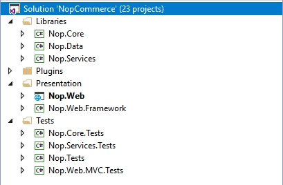

# Source code organization. Architecture of nopCommerce

This document is a guide for developers to the solution structure of nopCommerce. It is a document for a new nopCommerce developer to start learning about the nopCommerce code base. First of all, nopCommerce source code is quite easy to get. It's an open source application, so all you have to do to get the code is simply download it from the web site. The projects and folders are listed in the order they appear in Visual Studio. We recommend that you open the nopCommerce solution in Visual Studio and browse through the projects and files as you read this document.

Most of the projects, directories, and files are named so that you can get a rough idea of their purpose. For example, I don't even have to look inside the project called Nop.Plugin.Payments.PayPalStandard to guess what it does.

## `\Libraries\Nop.Core`

The Nop.Core project contains a set of core classes for nopCommerce, such as caching, events, helpers, and business objects (for example, Order and Customer entities).

## `\Libraries\Nop.Data`

The Nop.Data project contains a set of classes and functions for reading from and writing to a database or other data store. It helps separate data-access logic from your business objects. nopCommerce uses the Entity Framework (EF) Code-First approach. It allows you to define entities in the source code (all core entities are defined into Nop.Core project), and then get EF to generate the database from that. That's why it's called Code-First. You can then query your objects using LINQ, which gets translated to SQL behind the scenes and executed against the database. nopCommerces use  [Fluent API](https://www.entityframeworktutorial.net/efcore/fluent-api-in-entity-framework-core.aspx) to fully customize the persistence mapping.

## `\Libraries\Nop.Services`

This project contains a set of core services, business logic, validations or calculations related with the data, if needed. Some people call it Business Access Layer (BAL).

## Projects into `\Plugins\` solution folder

`\Plugins` is a Visual Studio solution folder that contains plugin projects. Physically it's located in the root of your solution. But plugins DLLs are automatically copied in ``\Presentation\Nop.Web\Plugins\` directory which is used for already deployed plugins because the build output paths of all plugins are set to``..\..\Presentation\Nop.Web\Plugins\{Group}.{Name}\`. This allows plugins to contain some external files, such as static content (CSS or JS files) without having to copy files between projects to be able to run the project.

## `\Presentation\Nop.Web`

`Nop.Web` is an MVC web application project, a presentation layer for public store which also contains administration panel included as an area. If you haven't used `ASP.NET`  before, please find more info [here](http://www.asp.net/). This is the application that you actually run. It is the startup project of the application.

## `\Presentation\Nop.Web.Framework`

Nop.Web.Framework is a class library project containing some common presentation things for `Nop.Web` project.

## `\Test\Nop.Core.Tests`

Nop.Core.Tests is the test project for the Nop.Core project.

## `\Test\Nop.Services.Tests`

Nop.Services.Tests is the test project for the Nop.Services project.

## `\Test\Nop.Tests`

Nop.Tests is a class library project containing some common test classes and helpers for other test projects. It does not have any test.

## `\Test\Nop.Web.MVC.Tests`

Nop.Web.MVC.Tests is the test project for the presentation layer projects.

## Tutorials

- [The Architecture behind the nopCommerce eCommerce Platform](https://www.youtube.com/watch?v=6gLbizzSA9o&list=PLnL_aDfmRHwtJmzeA7SxrpH3-XDY2ue0a)
