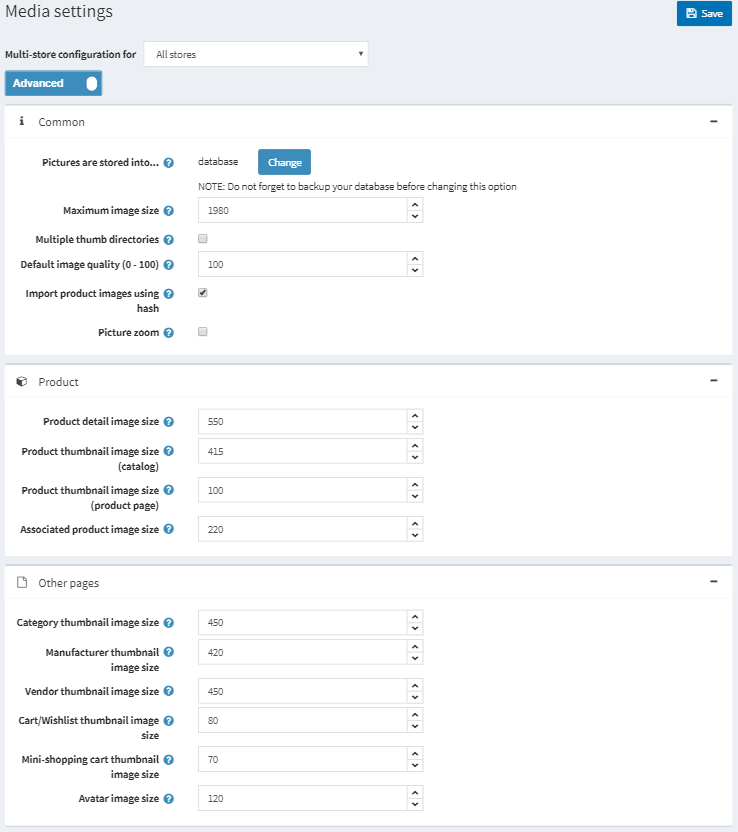

# Media Settings

This section describes how to set the media details of your store. This includes defining product, variants and avatar image sizes and more.

**To define the media settings:**

Go to **Configuration → Settings → Media Settings**. The Media Settings window is displayed:

Define the media settings, as follows:

- Click the **Change** button above **Pictures are stored into** option to choose between database or file system.

  > [!NOTE] It is recommended to make a backup of the database before clicking the Change button.
- In the **Maximum image size** field, enter the maximumProduct detail image size image size (meaning, the longest side) allowed for image upload (pixels).
- Tick **Multiple thumb directories** to have multiple thumb directories. Is useful when your hosting company has - limitations on the amount of files per directory.
- In the **Default image quality (0 - 100)** the quality of uploaded images is set. You would have to manually delete all already generated thumbs.
- Tick **Import product images using hash** to use HASHBYTES to compare pictures with uploaded products. Please note that this functionality is not supported by some databases.
- Tick **Picture zoom** to enable picture zoom on product details page.
- In the **Product detail image size** field, enter the default size for the product detail images in pixels.
- In the **Product thumbnail image size (catalog)** field, enter the default size for the product thumbnail images  displayed- on category or manufacturer pages in pixels.
- In the **Product thumbnail image size (product pages)** field, enter the default size for the product thumbnail images (pixels) displayed on the product details page (used when you have more than one product image).
- In the **Associated product image size** field, enter the default size for the associated product images in pixels. Associated products are part of grouped products.
- In the **Category thumbnail image size** field, enter the default size for the product thumbnail images on the category pages in pixels.
- In the **Manufacturer thumbnail image size** field, enter the default size for the product thumbnail images on the manufacturer pages in pixels.
- In the **Vendor thumbnail image size** field, enter the default size for the product thumbnail images on the vendor pages in pixels.
- In the **Cart/Wishlist thumbnail image size** field, enter the default size for product thumbnail images in the shopping cart and wishlist in pixels.
- In the **Mini-shopping cart thumbnail image** size field, enter the default size (pixels) of the product thumbnail images displayed in the mini-shopping cart block.
- In the **Avatar image size** field, enter the default size for avatar images.

This page enables **multi-store configuration**, it means that the same settings can be defined for all stores, or differ from store to store. If you want to manage settings for a certain store, choose its name from Multi-store configuration drop-down list and tick all needed checkboxes at the left side to set custom value for them.

## Tutorials

- [Managing media settings](https://www.youtube.com/watch?v=3JS4Zj4TBwQ)
