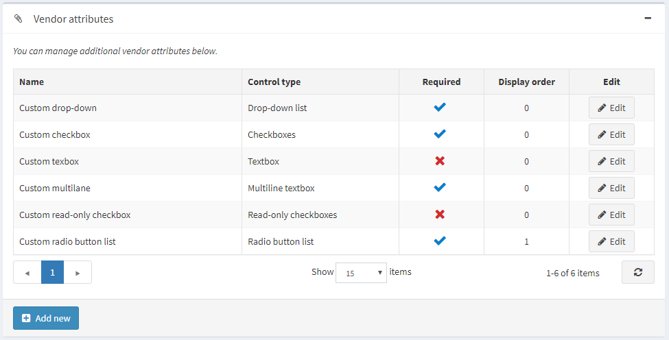
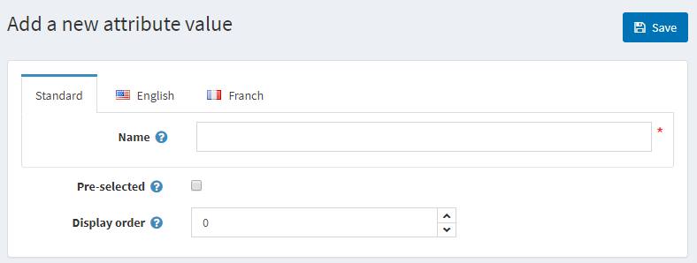

# Vendor settings

This section describes how to define the **vendor settings** of your store. This includes the number of vendors to display, whether or not to show the vendor on the product details pages of the store and more.

## Manage Vendor Settings

Go to **Configuration → Settings → Vendor Settings.** The Vendor Settings window is displayed:

Define the vendor settings, as follows:

* **Allow customers to apply for vendor account.** Firstly, a vendor request is filled by a user, thus creating a vendor account. Then the request is presented to a store-owner (via email notification) to be accepted.

    > [!WARNING]
    > A store owner has to add an appropriate customer record to "Vendors" role manually if he wants to grant access to the admin area.

* To require vendors to accept the **Terms of service** during registration.
* **Allow vendors to edit info** allows vendors to provide personal information in public store.
* Choose whether to **Notify about vendor information changes** to notify an admin about vendor information changes.
* **Maximum number of products** per vendor.
* **Allow vendors to import products** allows vendors to import products.
* **Allow customers to contact vendors** (send emails using contact forms). This functionality is available on a vendor details page in the public store. Localizable properties are not supported in a multiple languages setup.
* **Allow search by vendor** to customers, on an advanced search page.
* Choose whether to **Show vendor on product details page** (if associated).
* Choose whether to  **Show vendor name on order details page** (if associated).
* **Number of vendors to display** in the vendor navigation block in the admin area.

This page enables **multi-store configuration**, it means that the same settings can be defined for all stores, or differ from store to store. If you want to manage settings for a certain store, choose its name from Multi-store configuration drop-down list and tick all needed checkbox at the left side to set custom value for them.

## Vendor attributes

You can create any number of vendor attributes. Some different attributes that could be created would be business name, website and etc.

### Adding vendor attributes

Click **Add new** to add the attribute.

In the **Attribute Info** panel, define the following information:

* **Name** - the name of the vendor attribute.
* **Required** - when an attribute is required, vendors must choose an appropriate attribute value before they can continue.
* From the **Control Type** drop-down list, select the required method for displaying the attribute value: **Drop-down list, Radio button list, Checkbox, Textbox, Multiline textbox, Read-only checkbox.**
* **Display order** - the vendor attribute display order.

> [!NOTE]
> Dropdown lists, radio lists, checkbox and read-only checkbox  require the store owner to define values. Textbox and Multiline textbox control types do not require the store owner to define values since customers will be required to fill these textbox fields.

Click **Save and Continue Edit** to proceed to the **values** editing tab.

### Adding new attribute values

On the **Attribute values** panel, click **Add a new attribute value** to create a new attribute value.

In the Add a new attribute value window, define the following information:

* **Name** - the attribute value name.
* Tick the **Pre-selected** checkbox, to indicate the attribute value is pre-selected for a customer.
* **Display order** - display order number of the attribute value.

You can **edit** and **remove** attribute values by clicking the corresponding buttons beside the attributes on the Attribute values panel.

Click **Save.** The new attribute will be displayed in the public store.

## See also

* [Vendors](xref:ru/user-guide/configuring/setting-up/customers/vendors/index)
* [Setting up Customers](xref:ru/user-guide/configuring/setting-up/customers/index)
