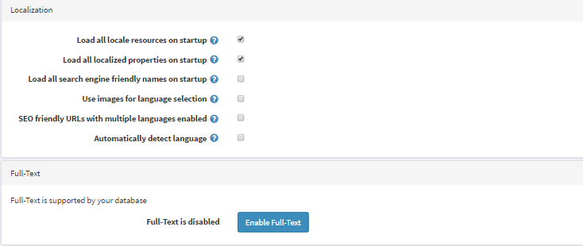

# Localization

If you wish to add a new language to your store, you should:

* Visit nopCommerce [marketplace](http://www.nopcommerce.com/marketplace.aspx)
* Sort results by language packs and download the desired language pack
* Follow the instructions from the language pack info

If you found a mistake in translation or wish to have custom naming, you can edit the string resources.

## Manage string resources

Go to **Configuration → Languages**. The Languages window is displayed:

Click Edit, beside the language. In the **Edit Language Details window**, select the **String resources panel**.

> [!TIP] For example, you want to change the name of a panel on top of the page from “Administration” (on the picture below) to “Control panel”.
> 
> 
> 
> In the Resource name field, enter administration. The required string resource if found. Click Edit beside it.
> 
> Enter the new name in the Value field and click update.
> 
> 
> 
> The changes are implemented
> 
> 

Click the **Add new record** to add a new string resource. The window is expanded enabling you to add a new resource record to the grid, as follows:

* In the Resource name field, enter the resource string identifier
* In the Resource value field, enter a value for this resource string identifier

Click **Save**.

## Localization settings

To configure localization settings go to **Configuration → Settings → General settings**

* Tick the checkbox **Load all local resources** to load all local resources on application startup
* Tick the checkbox **Load all localized properties on startup** to load all localized properties on application startup
* Tick the checkbox **Load all search engine friendly names on startup** to load all search engine friendly names on application startup
* Tick the checkbox **Use images for language selection** to use images instead of language names
* Tick the checkbox **SEO friendly URLs with multiple languages enabled** to allow SEO friendly URLs for all languages
* Tick the checkbox **Automatically detect language** for detecting language based on customer browser settings.