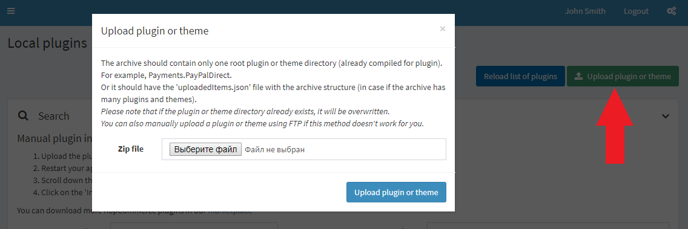
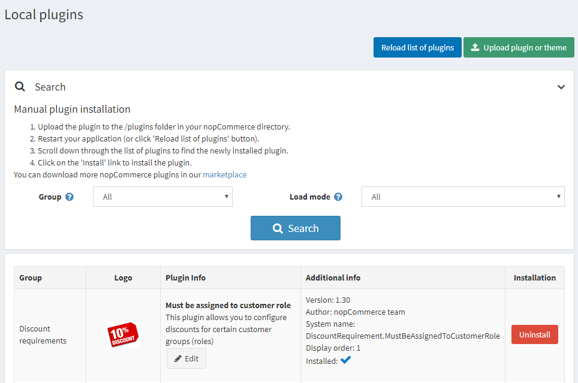

# Plugins

Plugins are a set of components adding specific capabilities to a nopCommerce store. Examples of plugins include Payment modules, Shipping Rate Computation Methods and more. This section describes how to install plugins manually.

nopCommerce has a variety of plugins, expanding your store functions, on its [marketplace](http://www.nopcommerce.com/marketplace).  The plugins can be installed either by downloading from the marketplace or by accessing the storefront right from the admin panel.

The plugins on the marketplace can be sorted by category, version, name or rating, and are free or paid.

The plugins available on the marketplace are developed either by the nopCommerce team, solution partners or third party vendors.

> [!NOTE]
  > plugins labelled “By nopCommerce team” are developed by the nopCommerce team and are distributed freely. Third-party services connectors are developed in the course of the Technology Partnership program, they are subject to nopCommerce [premium support services](http://www.nopcommerce.com/nopcommerce-premium-support-services) and are also distributed freely.

## To install a plugin

1. The user has two options for upload the plugin. You can use any that seems most convenient:
    1. Upload the plugin to the /plugins folder in your nopCommerce directory.  And restart your application (or click Reload list of plugins button).
    1. Upload the plugin or theme using the "Upload plugin or theme" button indicating the path to the location of the archive with the plugin in your local storage.

    > [!TIP]
  > You can download more nopCommerce plugins on our [extensions directory](https://www.nopcommerce.com/marketplace).

    

1. Scroll down through the list of plugins to find the newly installed plugin.
1. Click on the **Install** link to install the plugin.
1. The plugin is displayed in the Plugins windows (Configuration → Local Plugins).

    > [!NOTE]
  > If you're running nopCommerce in medium trust, then it's recommended to clear your `\Plugins\bin\` directory

## To uninstall a plugin

1. Go to **Configuration → Local Plugins**. The Plugins window is displayed:

    
1. Click the **Configure** link beside the plugin to go to the plugin’s configuration page. If the Configure link does not exist beside a plugin, this indicates the plugin does not require any configuration.
1. Click the **Uninstall** link beside the plugin to uninstall. The plugin is uninstalled. The link in the **Installation column** changes to **Install** enabling you to reinstall the plugin at any time.

## To change plugins’ friendly names and display order

1. Go to **Configuration → Local Plugins**. The Plugins window is displayed.
1. Click **Edit** beside the plugin. The Edit Plugin details, as follows:

    
1. Enter the **Friendly name**
1. In the **Display order** field, define the required location to display this plugin. 1 represents the top of the list.
1. From the **Limited to customer roles** drop-down list choose roles you want to be able to use this plugin
1. In the **Limited to stores** field, define the stores in which the plugin will be used.
1. Click **Save** at the top of the page.

## Tutorials

- [Installing a plugin (for versions 3.90 - 4.10)](https://youtu.be/eLDsSm-4gKA)
- [Managing access to plugins per customer role](https://www.youtube.com/watch?v=52lVVpQ3Qag)
