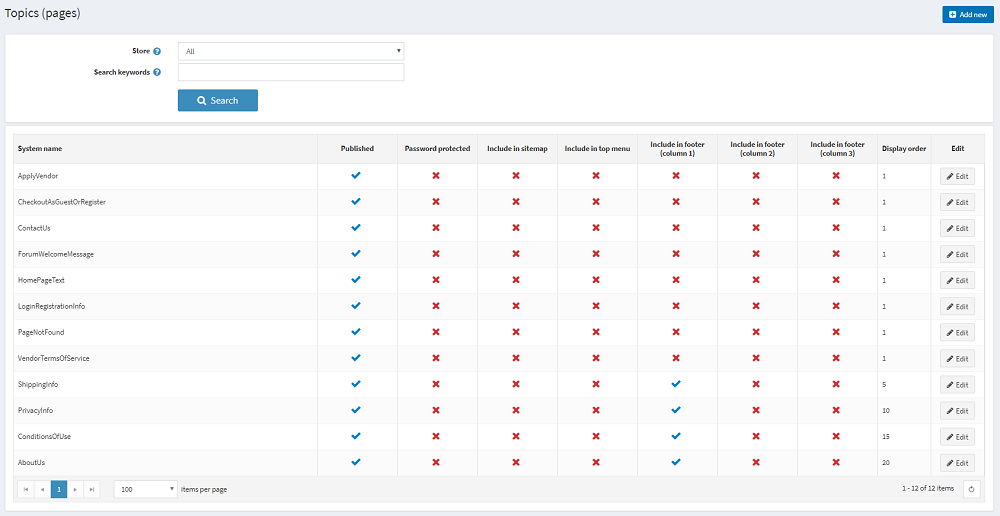
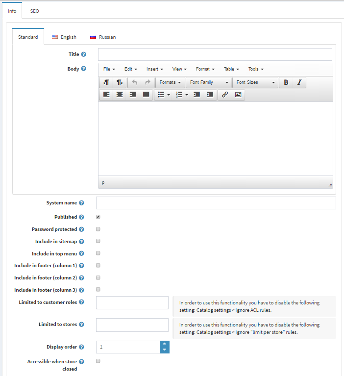
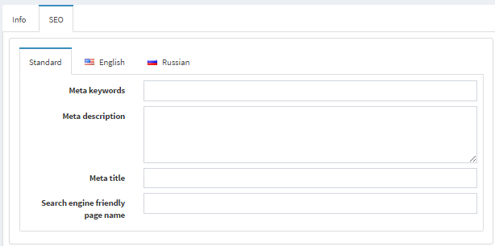

# Topics (pages)

Topics (pages) are free-form content blocks that can be displayed on your site, either embedded within other pages or on a page of their own. These are often used for FAQ pages, policy pages, special instructions, and so on. To create custom pages, you should create new topics, which you will see in the grid, and then enter your custom page content. Content can be written for each language separately.



**Search** for topics in the Topics window by entering topic text in the **Search keywords** field (or a part of the topic text), or among all the topics of a certain Store.

## Adding topics

To add new topic go to **Content management → Topics (pages)**

Click **Add new** and fill the information about a new topic.



- Enter the **Title** for the topic
- Add the **topic content** using the editor provided in the Body field
- Enter the **System name** of this topic. It is possible to use the same system name for different roles. For example, same system name for "Guest" and "Registered" customer roles.
- Tick **Published** checkbox to make this topic published
- Select the **Is password protected** checkbox, if this topic is password protected. The Password field is displayed and enter the password to access the content of this topic.
- You can include this topic in the **sitemap**, top menu, in footer (column 1), in footer (column 2), in footer (column 3) checkbox, to include this topic in the in the corresponding area  by ticking the corresponding checkbox
- Select this topic **Display order**. For example, 1 would represent the item first in a list.
- From the **Limited to customer roles** drop-down list select a customer role or roles that can access this topic
- In the **Limited to stores** select the stores in which the topic will be displayed

While editing existing topic or after clicking **Save and Continue Edit** button for a new one, you can click on **Preview** button to see how the topic will appear on the site.

## Setting up SEO for the topics

To set up SEO for Topics go to **SEO tab**



- Enter the required category **Meta keywords**, which are a brief and concise list of the most important themes of your page. The meta keywords tag takes the following format:

   ```html
   <meta name="keywords" content="keywords, keyword, keyword phrase, etc.">
   ```

- In the **Meta description** field, enter a description of the category. The meta description tag is a brief and concise summary of your page's content. The meta description tag is in the following format:

   ```html
   <meta name="description" content="Brief description of the contents of your page.">
   ```

- In the **Meta title** field, enter the required title. The title tag specifies the title of your Web page. It is code which is inserted into the header of your web page and is in the following format:

   ```html
   <head>
     <title>
        Creating Title Tags for Search Engine Optimization & Web Usability
      <title>
   </head>
   ```

- In the **Search engine friendly page name** field, enter the name of the page used by search engines. If you enter nothing then the web page URL is formed using the page name. If you enter custom-seo-page-name, then the following custom the URL will be used: `http://www.yourStore.com/custom-seo-page-name`

- Click **Save**. The topic will be displayed in the public store.

> [!NOTE]
>  You can click Edit in the Manage Topics window to display the Edit Topic window and then edit the topic, as described above. In the Topic Info tab, you can click on the URL link at the bottom of the page to view the URL of the topic in the public store.

## See also

- [SEO](xref:en/user-guide/marketing/content/seo)

## Tutorials

- [Adding new topic template](https://www.youtube.com/watch?v=M-g4Ux2GCaY)
