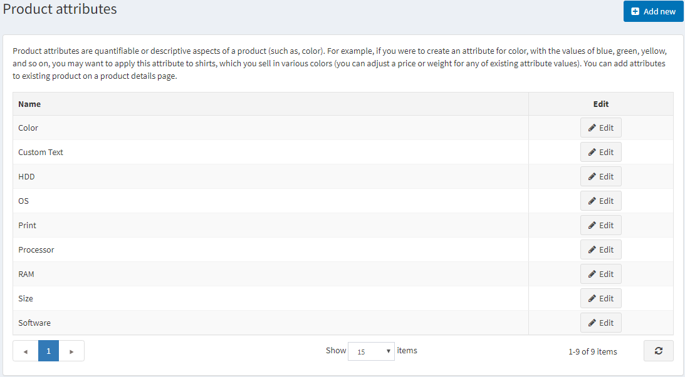
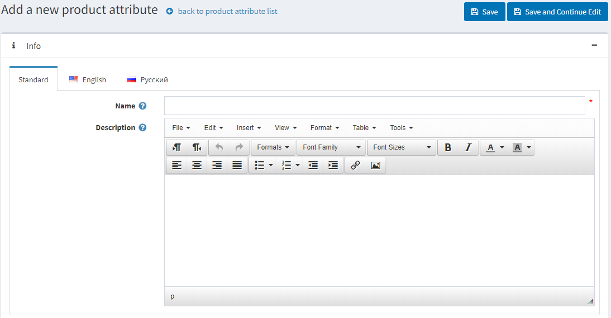

# Product attributes

Product attributes are **variations of a product** (such as color, size, etc.).

A user can create **different combinations** of the attributes. For example, a product can be in different sizes and colors. Thus, a user would create two attributes and their values, e.g. “size” (S, M, L) and “color” (Red, Blue, White), and then set up groups according to the availability of the products.

In nopCommerce, product attributes are used in **inventory tracking**, and can also cause the **price difference**.

To define product attributes go to **Catalog → Attributes → Product Attributes.**

> [!TIP] **By default**, there are **no product attributes precreated** in nopCommerce.

## Adding product attributes

Click **Add new** to add the attribute.

In the Add a new product attribute window fill the fields **Name** and **Description**.

Click **Save and Continue Edit** to proceed to the **values** editing window.

> [!TIP] [YouTube tutorial: Adding a product with color attributes](https://youtu.be/QihipwQ61YU)

## Adding predefined values

On the **Predefined Values panel** click Add a new value, an Add a new value window will be opened.

In the **Add a new value** window a user has an opportunity to:

- set up price or weight differences associated with the value.
- **Price adjustment. Use percentage** checkbox allows determining price adjustment in percentage instead of an absolute value.
- define a cost of different components which make up the value.
- determine whether the value is preselected for a customer as well as its display order in an attribute list.
- After filling the fields, click **Save**.

> [!TIP] **It's not necessary to create attributes values** when adding product attribute, you can create them later when will apply certain product attribute to the product. Once the attributes and values are set, they can be grouped and managed on the Product Attributes tab.

> [!NOTE] Some store owners prefer to highlight products differentiated by attributes and create a separate product with each specific attribute (for example, separately listed blue T-shirts and red T-shirts). In this case, we recommend creating a grouped product (shirts, as in the example) in order for all of the variations to be displayed on the same page, once the grouped product is being viewed by a customer. Read more about [grouped products](xref:ru/user-guide/running/product-management/products/adding-products/grouped-products).

## See also

- [Adding products](xref:en/user-guide/running/product-management/products/adding-products/index)
- [Grouped product](xref:en/user-guide/running/product-management/products/adding-products/grouped-products)

## Tutorials

- [Overview of conditional product attributes](https://www.youtube.com/watch?v=eIdHVcEdos8&t=55s)
